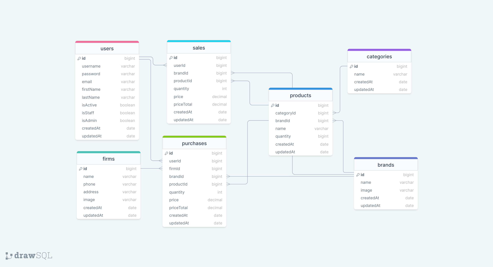

# STOCK MANAGEMENT API

### ERD:



### ERD-2 (snake_case):


### Folder/File Structure:

```
    .env
    .gitignore
    index.js
    package.json
    readme.md
    src/
        config/
            dbConnection.js
            swagger.json
        controllers/
            auth.js
            brand.js
            category.js
            firm.js
            product.js
            purchase.js
            sale.js
            token.js
            user.js
        helpers/
            passwordEncrypt.js
            sendMail.js
        middlewares/
            authentication.js
            errorHandler.js
            findSearchSortPage.js
            logger.js
            permissions.js
            upload.js
        models/
            brand.js
            category.js
            firm.js
            product.js
            purchase.js
            sale.js
            token.js
            user.js
        routes/
            auth.js
            brand.js
            category.js
            document.js
            firm.js
            index.js
            product.js
            purchase.js
            sale.js
            token.js
            user.js
```

## for backend
* create "logs" folder
* chanege .env name
* npm i
* nodemon .\swaggerAutogen.js
* nodemon
## for frontend
* chanege .env name
* check BASE_URL=http://127.0.0.1:8000
* npm i
* npm run dev
## for CORS
* npm i cors
* add cors code to index.js
```js
  app.use(cors({
    "origin":[ "http://localhost:5173",  "http://localhost:3000"],
    "methods": "GET,HEAD,PUT,PATCH,POST,DELETE",
  }))
```