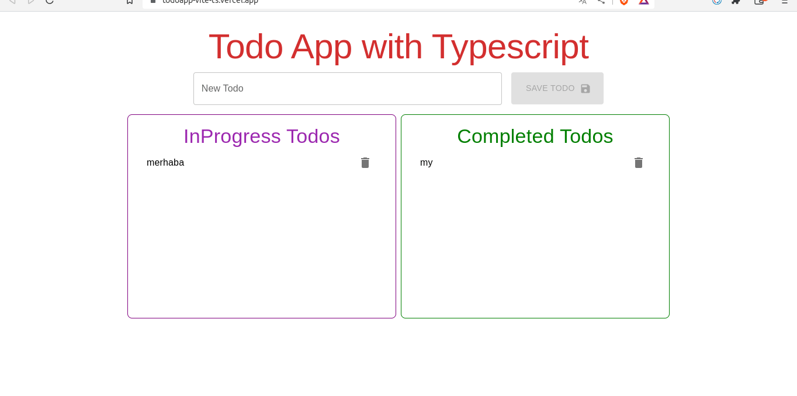
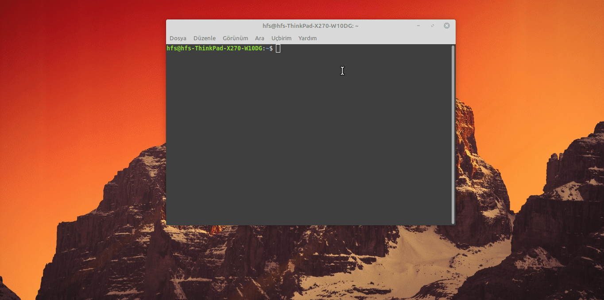

<p>Clarusway</p>

# TS-01 To-Do App with TypeScript

## Description

Project aims to create a To-Do App with TypeScript.

## Problem Statement

- We are adding a new project to our portfolios. So you and your colleagues have started to work on the project.

## Project Skeleton

```
Todoapp with TypeScript+Vite+Mui

SOLUTION
├── src
│    ├── App.tsx
│    ├── components
│    │   ├── AddTodoComp.tsx
│    │   ├── TodoListItem.tsx
│    │   └── TodoList.tsx
│    ├── pages
│    │   └── Home.tsx
│    ├── helper
│    │   └── sweetAlert.ts
│    ├── types.d.ts
│    └── vite-env.d.ts
├── package.json
├── index.html
├── .gitignore
├── README.md
├── vite.config.ts
├── tsconfig.node.json
├── tsconfig.json
└── pnpm-lock.yaml
```

```
Todoapp with TypeScript+React(CRA)

SOLUTION
├── package.json
├── public
│   ├── favicon.ico
│   ├── index.html
├── README.md
├── src
│   ├── App.tsx
│   ├── components
│   │   ├── AddTodoComp.tsx
│   │   ├── TodoListItem.tsx
│   │   └── TodoList.tsx
│   ├── helper
│   │   └── sweetAlert.ts
│   ├── index.tsx
│   ├── pages
│   │   └── Main.tsx
│   ├── react-app-env.d.ts
│   └── types.d.ts
├── tsconfig.json
└── yarn.lock
```

## Expected Outcome



## Objective

Build a TodoApp with Typescript using Vite+ReactJS.

### At the end of the project, following topics are to be covered;

- HTML
- CSS
- JS
- TS
- React

### At the end of the project, students will be able to;

- improve coding skills within HTML & CSS & JS & TS & React.

- use git commands (push, pull, commit, add etc.) and Github as Version Control System.

## Steps to Solution

- Step 1 : Vite using `pnpm create vite` or `yarn create vite` or `pnpm create vite todoapp --template react-ts`.

- Step 2 : Use mockApi for todos..

- Step 3 : You can use CSS frameworks like Bootstrap, Material UI etc.

- Step 3 : You can use notificitons like `react-toastify`,`sweetalert` etc.

- Step 4 : Add project gif to your project and README.md file.

## Notes

- You can add additional functionalities to your app.

## Demo

[TodoApp with Vite+Typescript](https://todoapp-vite-ts.vercel.app/)

[TodoApp with CRA+Typescript](https://ts-todo-xi.vercel.app/)

## MockApi

<a href="https://mockapi.io/" target="_blank">MockApi</a>

## How do we create mockApi? Watch the video!

<a href="https://www.youtube.com/watch?v=i_Gvlp83GMk" target="_blank">
 Watch the video
</a><br>
<br>

Or you can find **MockApi quick start guide** <a href="https://github.com/mockapi-io/docs/wiki/Quick-start-guide" target="_blank">here</a>

**<p align="center">&#9786; Happy Coding &#9997;</p>**

## Start Project Vite

```
Command => pnpm create vite or yarn create vite
Framework => React
Variant => Typescript

# or

pnpm create vite todoapp --template react-ts

```



## Start Project CRA

```
npx create-react-app todo-ts --template typescript

#or

yarn create react-app todo-ts --template typescript

```


